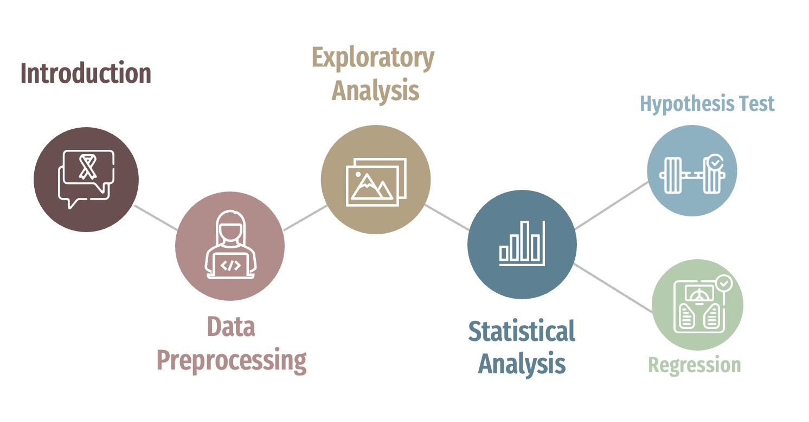
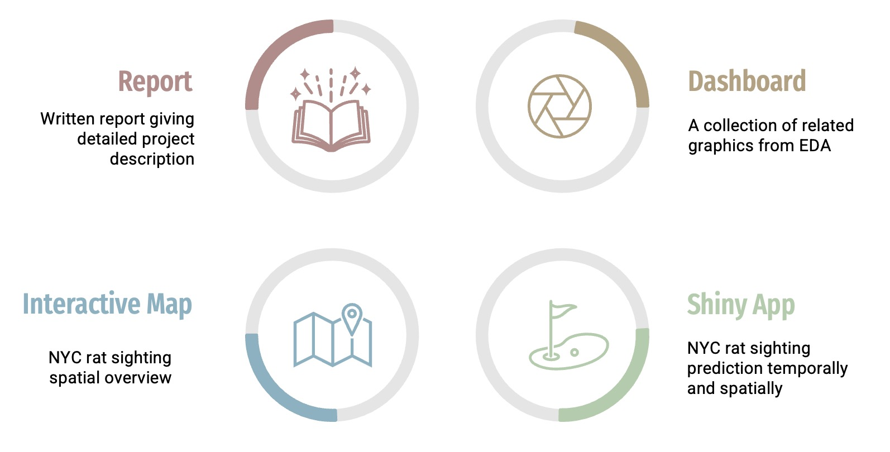

&nbsp;

<h2><strong>Motivation</strong></h2> 

New York City is the largest city in the United States. It is known for its hustle and bustle, Broadway shows, and Wall Street legends. However, the Big Apple as it is called is also known for a bit of a rat problem. There are actually claims that “you are never more than six feet from a rat in New York”. There are an estimated 2 million rats of approximately 40-50 members living in colonies across New York City, which is close to a quarter of New York's human population.

At one time, our team member Ziyan and her friends were finishing an outdoor dinner in Chelsea recently when, from the corner of her eye, she saw something move near the edge of their table: A rat had been on the table. Rats are among New York’s permanent features and across the city, one hears the same thing: they are running amok like never before. Rats in NYC are almost everywhere, in the park, on your block and even at your table.

According to new data, more rats have been spotted in 2022 alone than at any point in the last decade, with 16,000 rodents sightings reported through the end of July, up from 2,000 a year ago. Rats are becoming the bane of New Yorkers’ existence nowadays. In order to deal with this intractable issue, our group are going to use the rodent inspection dataset provided by the <a style="text-decoration:none" href="https://data.cityofnewyork.us/Health/Rodent-Inspection/p937-wjvj"> Rat Information Portal (RIP)</a> to do data analysis on evidence of rat activities. 

Gaining deeper sights into the pattern of rat inspections in both the temporal and spatial dimensions will help those in fear of rats minimize exposure as much as possible. Broadly, it is beneficial to identify potential risks of disease-spread and then build a clean and pleasant living environment, which is what we as public health students should be working towards.

&nbsp;

&nbsp;

<h2><strong>Project Outline</strong></h2> 

&nbsp;

&nbsp;

<h2><strong>Expected Deliverables</strong></h2> 

&nbsp;

&nbsp;

<h2><strong>Sceancast</strong></h2> 

<iframe width="910px" height = "512px" src="https://www.youtube.com/embed/6rNvxML07CU" frameborder="0" allow="accelerometer; autoplay; clipboard-write; encrypted-media; gyroscope; picture-in-picture" allowfullscreen ></iframe>

&nbsp;

&nbsp;

&nbsp;

<h2><strong>Group Members</strong></h2> 

